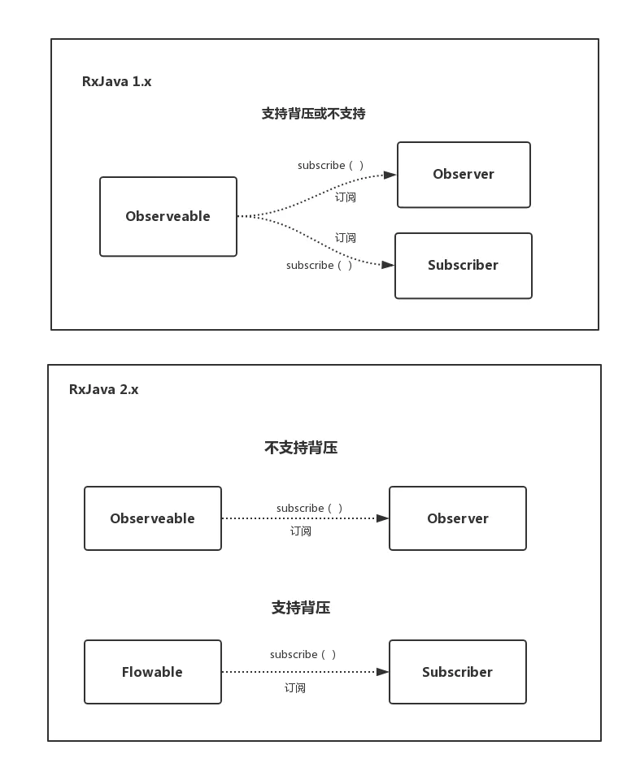

# RxJava2-Example

This is an example for RxJava2

- 没有什么场景一定要用 RxJava2.

优点：

- 响应式编程/流式编程/函数编程：基于异步数据流  
  不使用 callback 就能实现数据变换  
  责任分明：上游分发数据，下游处理数据
- 异步  
  线程转换方便，不阻塞线程。  
  节省线程，把一类操作放在统一个线程池去执行。
- 链式调用：代码虽然很长，但是逻辑清晰和简洁：

# 1 观察者模式

- RxJava 是一种扩展的观察者模式
- 观察者模式

| -                    | 角色                 |
| -------------------- | -------------------- |
| View                 | 被观察者 -> 发送事件 |
| OnClickListener      | 观察者 -> 接收事件   |
| setOnClickListener() | 订阅                 |
| onClick()            | 事件                 |

订阅之后，用户点击按钮的瞬间，Android Framework 将点击事件发送给已经注册的 OnClickListener


| -           | 角色                                    |
| ----------- | --------------------------------------- |
| Observable  | 被观察者                                |
| Observer    | 观察者                                  |
| subscribe() | 订阅                                    |
| onClick()   | 事件 : onNext()/onCompleted()/onError() |

普通事件 （相当于 onClick() / onEvent()）之外，还定义了两个特殊的事件：。

  


- 根据是否支持背压（Backpressure），有两种观察者模式  
  observer_design.webp



## 元素

# 1 Observable

- 不 onSubscribe，Observable 不执行。

## onComplete

- onComplete()后，它之后的 onNext()不再生效。

```java
// test_onComplete()
@Override
public void subscribe(@NonNull ObservableEmitter<Integer> emitter) throws Exception {
    emitter.onNext(1);
    emitter.onNext(2);
    emitter.onComplete();
    emitter.onNext(3);
    emitter.onNext(4);
    emitter.onNext(5);
}
```

- onNext 后，不会自动添加 onComplete，需要手动发出 onComplete()，否则认为事件队列还没有发送完

```java
// test_onComplete2
public void subscribe(@NonNull ObservableEmitter<Integer> emitter) throws Exception {
    emitter.onNext(1);
    emitter.onNext(2);
    emitter.onNext(3);
    emitter.onNext(4);
    emitter.onNext(5);
}
```

## onError

- onError()后，它之后的 onNext()不再生效。  
  若创建 Observable 时，有错误，自动发出 onError()事件。

```java
// test_onError
@Override
public void subscribe(@NonNull ObservableEmitter<Integer> emitter) throws Exception {
    emitter.onNext(1);
    emitter.onNext(2);
    emitter.onError(new Exception("error:stop emit"));
    emitter.onNext(3);
    emitter.onNext(4);
    emitter.onNext(5);
}
```

- 接受方接收 onError()/onComplete()其中一个，不会再发送和接收任何一个事件。  
  在一个正确运行的事件序列中, onCompleted() 和 onError() 有且只有一个，并且是事件序列中的最后一个。onCompleted() 和 onError() 二者也是互斥的，即在队列中调用了其中一个，就不应该再调用另一个。

  即：事件序列终止：onError()/onComplete() / onNext()+Disponse.disponse()

## emit void

```java
emitter.onNext(Unit.INSTANCE);
```

# 2 Observer

- Disposable:用于解除订阅

```java
// test_Disposable
if (null != mDisposable && !mDisposable.isDisposed()) {
    mDisposable.dispose();
    mDisposable = null;
}
```

- 接到 onCompleted() / onError()事件后，内部自动调用 Disposable.dispose()。

```java
// ObservableCreate

@Override
public void onComplete() {
    if (!isDisposed()) {
        try {
            observer.onComplete();
        } finally {
            dispose();
        }
    }
}

@Override
  public void onError(Throwable t) {
      if (!tryOnError(t)) {
          RxJavaPlugins.onError(t);
      }
  }

  @Override
  public boolean tryOnError(Throwable t) {
      if (t == null) {
          t = new NullPointerException("onError called with null. Null values are generally not allowed in 2.x operators and sources.");
      }
      if (!isDisposed()) {
          try {
              observer.onError(t);
          } finally {
              dispose();
          }
          return true;
      }
      return false;
  }
@Override
public void dispose() {
    DisposableHelper.dispose(this);
}
```

# 2 线程调度

## 切换线程

| 切换线程    |
| ----------- |
| subScribeOn |
| observeOn   |

// test_subscribeOn_vs_observeOn

### subScribeOn

- 指定发射事件的线程.
- 多次指定时，只有第一次指定有效。

### observeOn

- 指定接收事件的线程。
- 多次指定线程每次都效。

## 线程

| 线程                           | When             |
| ------------------------------ | ---------------- |
| `Schedulers.io()`              | 网络、读写文件   |
| Schedulers.computation()       | CPU 密集型计     |
| Schedulers.newThread()         | 一个新线程       |
| Schedulers.single()            | 单个线程         |
| AndroidSchedulers.mainThread() | Android 的主线程 |

- RxJava 内部使用线程池维护这些线程。
- 不要把 I/O 操作放在 computation() 中，否则 I/O 操作的等待时间会浪费 CPU

# 3 操作符

- debounce  
  控制频率： 防止输入过快。

- flatMap  
  数据变换：从一个 Observable 对象转化为一个 Observable 对象，后续继续对它进行操作。
- EndlessSubscribe ：  
  得到：订阅前的最后一个 + 开始订阅后。。。。

## Interval

```java
// IntervalExample
Flowable.interval(1, TimeUnit.SECONDS)  // 不延迟，只要订阅，立刻发送

Flowable.interval(10, 1, TimeUnit.SECONDS) //  先延迟10s，再发送心跳
```

- 每隔一段时间发送一个事件
- 场景：定时任务/心跳/轮训
- 默认 subscribeOn(Schedulers.computation())。指定为其他线程,e.g., `subscribeOn(Schedulers.io())`, 也不会生效。
- 手动通过 Disposable.dispose()停止，否则一直发事件。

## zip

- 并发请求
- 场景：同时访问多个接口，顺序无关
- 当两个请求都获取成功的时候才算成功，如果有一个没获取成功则算失败，需要重新获取。

# Refs

- https://gank.io/post/560e15be2dca930e00da1083#toc_2
